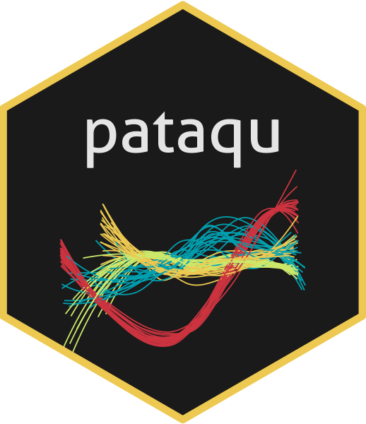

<!-- README.md is generated from README.Rmd. Please edit that file -->

```{r, include = FALSE}
knitr::opts_chunk$set(
  collapse = TRUE,
  comment = "#>",
  fig.path = "man/figures/README-",
  out.width = "100%"
)
```

# pataqu []() 

<!-- badges: start -->
<!--[](https://CRAN.R-project.org/package=pataqu)-->
[](https://github.com/vbonhomme/pataqu/actions)
[](https://lifecycle.r-lib.org/articles/stages.html#experimental)
[](https://github.com/vbonhomme/pataqu/commits/master)
[](https://app.codecov.io/gh/vbonhomme/pataqu?branch=master)


<!-- badges: end -->

pataqu uses permutationnal approach to deal with data that comes with uncertainties on x. 

It it typically aimed at working with temporal data that are not exactly defined but comes with lower (and upper) bounds, also called [terminus ante (and post) quem](https://en.wikipedia.org/wiki/Terminus_post_quem). 

It can also be used when dating, typically [radiocarbon dating](https://en.wikipedia.org/wiki/Radiocarbon_dating), comes with a confidence interval likely to affect interpretation.
 
More generally, it is a permutationnal approach that allows to inspect both graphically and statistically the effects of x uncertainties.

## Installation

You can install the development version of pataqu from [GitHub](https://github.com/) with:

``` r
# install.packages("devtools")
devtools::install_github("vbonhomme/pataqu")
```

Or the latest version released on CRAN with:

``` r
install.packages("pataqu")
```
