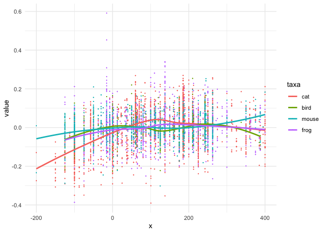
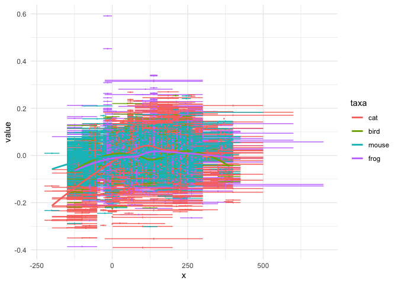
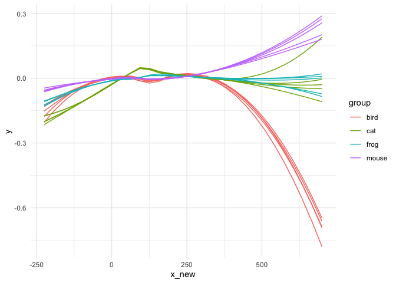

<!-- README.md is generated from README.Rmd. Please edit that file -->

# pataqu

<!-- badges: start -->

[](https://github.com/vbonhomme/pataqu/actions)
[](https://app.codecov.io/gh/vbonhomme/pataqu?branch=master)
<!-- badges: end -->

pataqu uses permutationnal approach to deal with data that comes with
uncertainties on x.

It it typically aimed at working with temporal data that are not exactly
defined but comes with lower (and upper) bounds, also called [terminus
ante (and post) quem](https://en.wikipedia.org/wiki/Terminus_post_quem).

It can also be used when dating, typically [radiocarbon
dating](https://en.wikipedia.org/wiki/Radiocarbon_dating), comes with a
confidence interval likely to affect interpretation.

More generally, it is a permutationnal approach that allows to inspect
both graphically and statistically the effects of x uncertainties.

## Installation

You can install the development version of pataqu from
[GitHub](https://github.com/) with:

``` r
# install.packages("devtools")
devtools::install_github("vbonhomme/pataqu")
```

Or the latest version released on CRAN with:

``` r
install.packages("pataqu")
```

## Example

Let’s say you measure a `value` of interest on archaeological animal
remains. These remains are recovered from sites only dated with terminus
ante and post quem. In these sites, you find several species and you
would like to test :

1.  The effect of these temporal uncertainties
2.  How they affect the temporal trend of each species
3.  When and between which pairs they differ

We first load `pataqu` and then have a look to the `animals` dataset

``` r
library(pataqu)
head(animals)
#>   taxa   site      us  tpq taq       value
#> 1 frog Alz-Br  A-B_FO -125 -50 -0.03521491
#> 2 frog Ans-lM  A-M_12   50 700 -0.12260232
#> 3 frog Ans-lM  A-M_12   50 700 -0.12933662
#> 4 frog Ans-lM A-M_139  150 200  0.11962616
#> 5 frog Ans-lM An-M_15   50 700  0.05752877
#> 6 frog Ans-lM A-M_150   50 200  0.05275057
# We only show the first lines but you can View(animals)
```

Let’s visualize what happens if you decide to take the midpoint between
your tpq and your taq and display temporal trend for each species:

``` r
library(dplyr)
#> 
#> Attaching package: 'dplyr'
#> The following objects are masked from 'package:stats':
#> 
#>     filter, lag
#> The following objects are masked from 'package:base':
#> 
#>     intersect, setdiff, setequal, union
library(ggplot2)

# create the mid point
animals_mid <-  mutate(animals, x=(tpq + taq)/2)
head(animals_mid)
#> # A tibble: 6 × 7
#>   taxa  site   us        tpq   taq   value     x
#>   <fct> <chr>  <chr>   <dbl> <dbl>   <dbl> <dbl>
#> 1 frog  Alz-Br A-B_FO   -125   -50 -0.0352 -87.5
#> 2 frog  Ans-lM A-M_12     50   700 -0.123  375  
#> 3 frog  Ans-lM A-M_12     50   700 -0.129  375  
#> 4 frog  Ans-lM A-M_139   150   200  0.120  175  
#> 5 frog  Ans-lM An-M_15    50   700  0.0575 375  
#> 6 frog  Ans-lM A-M_150    50   200  0.0528 125

# visualize with a loess
ggplot(animals_mid) +
 aes(x=x, y=value, col=taxa) +
 geom_point(size=0.1) +
 geom_smooth(method="loess", formula="y~x", se=FALSE) +
 theme_minimal()
```



What a mess! And still, we do not take into account uncertainties on
dating, which is the reason we are all here today. A more realistic view
would be something like:

``` r
ggplot(animals_mid) +
 aes(x=x, y=value, col=taxa) +
 geom_errorbarh(aes(xmin=tpq, xmax=taq)) +
 geom_point(size=0.1) +
 geom_smooth(method="loess", formula="y~x", se=FALSE) +
 theme_minimal()
```

 Here
comes pataqu.

We will simulate 5 new datasets with randomized datations. The true
dates can be anytime between ptq and taq. We use `quake_uniform`.

``` r
a_q <- animals %>% 
  quake_uniform(tpq, taq, value, k=5, group=taxa)
#>  * working on a temporal sequence of 30 steps
#>  * launching 5 permutations
```

Let’s have a look to the results:

``` r
a_q
#> # A tibble: 600 × 4
#>        k group   x_new        y
#>    <int> <chr>   <dbl>    <dbl>
#>  1     1 cat   -225    -0.201  
#>  2     1 cat   -193.   -0.180  
#>  3     1 cat   -161.   -0.157  
#>  4     1 cat   -129.   -0.134  
#>  5     1 cat    -97.4  -0.109  
#>  6     1 cat    -65.5  -0.0836 
#>  7     1 cat    -33.6  -0.0567 
#>  8     1 cat     -1.72 -0.0296 
#>  9     1 cat     30.2  -0.00440
#> 10     1 cat     62.1   0.0213 
#> # … with 590 more rows
spaghetti(a_q)
```

 One
can now test *globally* when pattersn between taxa differ:

``` r
res_global <- a_q %>% synchrony()
#>  * testing on 30 temporal slices
#>  * testing pairwise differences using kruskal_p
res_global %>% filter(p<1e-4)
#> # A tibble: 0 × 2
#> # … with 2 variables: x_new <dbl>, p <dbl>
```

But also test for pairwise differences:

``` r
res <- a_q %>% synchrony_pw()
#>  * testing on 30 temporal slices
#>  * testing global differences using wilcox_p
head(res)
#> # A tibble: 6 × 3
#>   x_new pw                 p
#>   <dbl> <chr>          <dbl>
#> 1  -225 bird ~ cat   0.00794
#> 2  -225 bird ~ frog  0.222  
#> 3  -225 bird ~ mouse 0.00794
#> 4  -225 cat ~ frog   0.00794
#> 5  -225 cat ~ mouse  0.00794
#> 6  -225 frog ~ mouse 0.00794
```

And we can also check only those that differ:

``` r
 res %>% filter(p<0.0001)
#> # A tibble: 0 × 3
#> # … with 3 variables: x_new <dbl>, pw <chr>, p <dbl>
```
